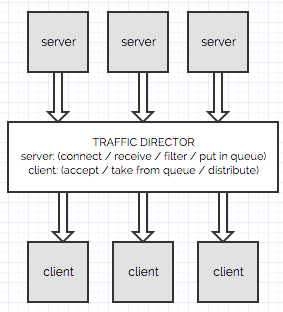

# JSON TCP Distributor

Overview
========
JSON TCP Distributor is used for efficiently distributing incoming JSON events over TCP across multiple back-end 
nodes. 

Use this app if you need to: 
1. Connect to one or more JSON producing servers which send a continuous stream of JSON (or CSV or Strings), and,
2. Optionally filter or transform incoming events (e.g. apply throttle, drop invalid, tag etc.), and,
3. Distributed incoming events to two or more back-end nodes.
 
JSON TCP Distributor works with JSON, but will also work with CSV or any String. The only requirement is that the
events must be separated by new lines.

Requirements
============

* Java SE 7
* Apache Maven 
* Works on Linux, Windows, Mac OSX and (quite possibly) BSD.

Install
=======

To build the JAR file, go to the main project folder and run the following command:

<code>
$ mvn clean package
</code>

To execute the JAR file:

<code>
$ java -jar target/TrafficDistributor-1.0-SNAPSHOT-jar-with-dependencies.jar
</code>

Why not use a Message Broker or Messaging Middleware?
=====================================================

The short answer is that you could and you should if your requirements allow for it (i.e. you have full control over 
the events producers and could modify their behavior to send events to a broker).

I built a similar project to retrieve tens of thousands of events from several 3rd party sniffers and 
distribute them to a cluster of clients. When an event is received, a filter is applied and the event is dropped if
some condition is met (e.g. invalid event, threshold reached, etc.)

